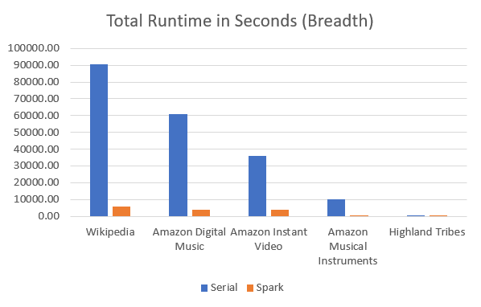
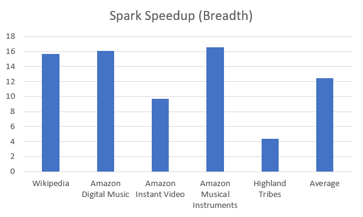

# Timing Experiment

This report summarizes timing performance of the graphB code. 

**Author**: [Eric Hull](https://github.com/hullo-eric), undergraduate researcher in Data Lab 2020. 

## Datasets


| Dataset | # of Nodes | # of Edges | Link to Source |
| --------- | --------- | ---------- | ---------- | 
| Wikipedia admin election data from SNAP | 7115 | 103689 | [SNAP](https://snap.stanford.edu/data/wiki-Vote.html) |  
| Amazon Digital Music Reviews (5-Core) | 9109 | 64706 | [UCSD](http://jmcauley.ucsd.edu/data/amazon/links.html) | 
| Amazon Instant Video Reviews (5-Core) | 6815 | 37126 | [UCSD](http://jmcauley.ucsd.edu/data/amazon/links.html) |
| Amazon Musical Instruments Reviews (5-Core) | 2329 | 10261 | [UCSD](http://jmcauley.ucsd.edu/data/amazon/links.html) |
| Highland Tribes Alliance Data | 16 | 116 | [UCINET](http://vlado.fmf.uni-lj.si/pub/networks/data/ucinet/ucidata.htm#gama) |  

## Runtime Comparison Between Apache Spark and Serial Processing on TXState's LEAP HPC  

**1000 spanning trees were generated for each experiment**  
**Spark/Slurm settings:**
```
  >> num nodes: 4
  >> num processors: 28
  >> executor-cores: 4
  >> num-executors: 27
  >> executor-memory: 17g
  >> driver-memory: 17g
```
**Config Reasoning**  

* To get good HDFS throughput, 4 cores per executor were assigned.   
* Number of cores available per node = 28  
* Using 4 nodes, this means we have 4 * 28 = 112 total available CPUs.  
* With 4 cores per executor, we have 112 / 4 = 28 available executors.  
* Leaving 1 executor for Spark ApplicationManager = 27 executors actually used.  
* Number of executors per node = 27 / 4 = 6 or 7  
* Memory per executor = 128GB / 7 = 18.28 GB  
* Leave 7% of Memory for Heap overhead = 18.28 - (.07 * 18.28) = 17.005 GB executor memory/driver memory  
[Reasoning derived from this article](https://spoddutur.github.io/spark-notes/distribution_of_executors_cores_and_memory_for_spark_application.html)  
[LEAP specs here](https://doit.txstate.edu/rc/leap.html)




| Dataset | Parallelization Type | Tree Type | Total Runtime | Total Preprocess Time | Total Process Time | Total Postprocess Time | Spark Speedup |
| ---------------- | ---------------- | --------------- | --------------- | --------------- | --------------- | --------------- | --------------- |
| Wikipedia | Serial | Random | 1 days 05:24:49.02 | 0 days 00:01:20.46 | 1 days 04:42:54.81 | 0 days 00:40:33.75 | N/A |
| Wikipedia | Spark | Random | 0 days 01:45:33.56 | 0 days 00:01:31.85 | 0 days 01:39:22.02 | 0 days 00:04:39.69 | 16.72 |
| Wikipedia | Serial | Breadth | 1 days 01:10:31.99 | 0 days 00:01:20.57 | 1 days 00:29:46.08 |	0 days 00:39:25.35 | N/A |
| Wikipedia | Spark | Breadth | 0 days 01:36:20.45 |	0 days 00:01:19.11 |	0 days 01:30:23.54 |	0 days 00:04:37.80 | 15.68 |
| Amazon Digital Music | Serial | Breadth | 0 days 16:58:01.83 |	0 days 00:01:50.34 |	0 days 16:07:17.83 |	0 days 00:48:53.67 | N/A |
| Amazon Digital Music | Spark | Breadth | 0 days 01:03:15.30 |	0 days 00:01:53.04 | 0 days 00:57:59.48 | 0 days 00:03:22.77 | 16.09 |
| Amazon Instant Video | Serial | Breadth | 0 days 09:59:32.65 | 0 days 00:01:07.33 |	0 days 09:24:07.44 | 0 days 00:34:17.88 | N/A |
| Amazon Instant Video | Spark | Breadth | 0 days 01:01:44.11 | 0 days 00:01:02.97 | 0 days 00:56:29.30 | 0 days 00:04:11.84 | 9.71 |
| Amazon Musical Instruments | Serial | Breadth | 0 days 02:46:18.57 | 0 days 00:00:09.86 | 0 days 02:33:32.82 | 0 days 00:12:35.88 | N/A |
| Amazon Musical Instruments | Spark | Breadth | 0 days 00:10:02.44 | 0 days 00:00:10.01 | 0 days 00:08:53.69 | 0 days 00:00:58.74 | 16.56 |
| Highland Tribes | Serial | Breadth | 0 days 00:01:56.62 | 0 days 00:00:00.12 | 0 days 00:01:35.49 | 0 days 00:00:21.02 | N/A |
| Highland Tribes | Spark | Breadth | 0 days 00:00:26.86 | 0 days 00:00:00.07 |	0 days 00:00:13.11 | 0 days 00:00:13.68 | 4.34 |  

### Summary  

* Average overall speedup using spark configs above was very good, at **12.51**. The only portion of the code that utililzed spark parallelization was the tree generation and balancing portion (process). This was done because it was the biggest bottleneck in overall time, and the process could be parallelized simply. Note the serial Total Process Time vs. Total Preprocess or Total Postprocess time, for any of the datasets above. The large majority of the time was spent in the Process step. 
* Improvements could be made by parallelzing Preprocess and Postprocess, though the gains would not be as significant since they are already a small portion of the total runtime. It should be noted that as graph size scales, preprocess does become a significant time factor and would definitely need to be improved for graphs over 100K edges.

### File I/O Effects of GraphB  

* GraphB uses h5 file format for all interim data storage between preprocess, process, and postprocess, steps. This provides convenient storage and later access of any data generated, but it also contributes to the long runtime it experiences as dataset size scales. Every spanning tree that is generated will be written to its own h5 file, so for 1000 trees, 1000 unique h5 files will be made and have a significant amount of data written. During the postprocess step in which status values are calculated, each one of these h5 files must be accessed for their respective spanning tree info.  

* The actual tree generation and balancing takes up a small portion of the total process time. **The time effects can be seen when looking at the detailed timing logs below. The time to do just the balancing without reading or writing any h5 files is recorded in the SUM TOTAL BALANCE TIME column.**  
```
Total Balance Time as a percentage of Total Process Time (Serial)
>> Random: (21282.87 / 88186.08 ) * 100 = 24.13%  
>> Breadth: (34620.12 / 103374.81) * 100 = 33.49%  
```  
  
**Time in Seconds (Serial)**
| Wiki Tree Type | GLOBAL TIME | TOTAL PREPROCESS TIME | TOTAL PROCESS TIME | TOTAL POSTPROCESS TIME | SUM TOTAL BALANCE TIME | AVG TOTAL BALANCE TIME | SUM BALANCE TIME | AVG BALANCE TIME | SUM TREE TIME | AVG TREE TIME | SUM COMPONENT LIST GEN TIME | AVG COMPONENT LIST GEN TIME | SUM COMPONENT STATS TIME | AVG COMPONENT STATS TIME | VERTEX DF TIME | CALC STATUS TIME | MATRIX CREATE TIME | SYM MATRIX CREATE TIME |  
| ----- | ----- | ----- | ----- | ----- | ----- | ----- | ----- | ----- | ----- | ----- | ----- | ----- | ----- | ----- | ----- | ----- | ----- | ----- |
| Random | 90632 | 81 | 88186 | 2365 | 21283 | 21 | 19734 | 20 | 1549 | 2 | 96 | 0 | 8 | 0 | 2362 | 41 | 0 | 4 |
| Breadth | 105889 | 80 | 103375 | 2434 | 34620 | 35 | 29023 | 29 | 5597 | 6 | 478 | 0 | 9 | 0 | 2430 | 40 | 0 | 5 |  

**------Key for column names------**  
* **GLOBAL TIME:** The total runtime of graphB for given config options  
* **TOTAL PREPROCESS TIME:** The total runtime to execute everything in preprocess_general.py  
* **TOTAL PROCESS TIME:** The total runtime to execute everything in process_general.py  
* **TOTAL POSTPROCESS TIME:** The total runtime to execute everything in postprocess_general.py  
* **TOTAL BALANCE TIME (SUM/AVG):** TREE TIME + BALANCE TIME, the total time to generate a tree and run balancing algo.  
* **BALANCE TIME (SUM/AVG):** The time to run balancing algo.  
* **TREE TIME (SUM/AVG):** The time to generate the spanning tree of given type.  
* **COMPONENT LIST GEN TIME (SUM/AVG):** Time to generate the list of majority/minority members for given spanning tree.  
* **COMPONENT STATS TIME (SUM/AVG):** Time to add size of majority/minority to component list for given spanning tree.  
* **VERTEX DF TIME:** Total time to create the vertex df in postprocess (accesses all tree h5s).  
* **CALC STATUS TIME:** Time to calculate status values (does not include accessing h5s, uses vertex df for data).  
* **MATRIX CREATE TIME:** Time to turn input edges and users csvs into csr matrix for preprocess.  
* **SYM MATRIX CREATE TIME:** Time to generate and save the preprocess symmetric matrix to h5.  

## Conclusion

* Due to timing bottlenecks from reading/writing lots of data to h5 files, graphB hits a practical ceiling of scaling to graphs of around 100K edges. This was shown in the timing results above, i.e. Wikipedia serial total runtime was over an entire day. This bottleneck could be mitigated using Apache spark to parallelize the many h5 file operations, and achieved an average speedup of 12.51 over serial processing.
* In order to be able to handle larger graphs, graphB would need to have the preprocess portion of the code parallelized, as it consumes huge amounts of time on graphs larger than the 100K edge mark. These results were not shown here, but can be independently verified by running the code on larger datasets. 


