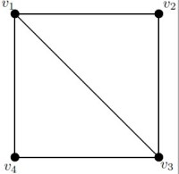
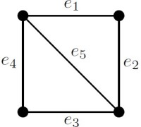
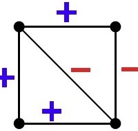
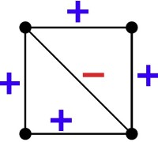

# Dataset Notations, Format, and Example

| Underlining unsigned graph |  |   |


| Example    | Figure     |  Data     |
| -----------| ---------- | --------- |
| Example 1A |  | [users](Input_Data/test1A_users.csv) and [edges](Input_Data/test1A_edges.csv) |
| Example 2A |  | [users](Input_Data/test2A_users.csv) and [edges](Input_Data/test2A_edges.csv) |

More reproducibility test data in [Input_Data](Input_Data/README.md) folder

## Input_Data format 

The Raw_Data directory will primarily consist of two types of csv files.
* The users.csv file maps the Node_ID to the User_ID and may contain Labels. 
* The edges.csv file consists of three columns. "From_Node_ID", "To_Node_ID", "Edge_Weight"
* Note: No 0 Edge_Weight should be in edges.csv

name1_name2_users.csv example without labels:  
 ``` 
  Node ID,User ID
  0,R1
  1,R2
  2,R3
  ..
```
name1_name2_users.csv example with labels:  
```
  Node ID,User ID,Labels
  0,R1,1
  1,R2,0
  2,R3,1
  ...
```

name1_name2_edges.csv example:  
``` 
  From Node ID, To Node ID, Edge Weight
  0,1,-1
  0,2,-1
  1,2,1
  ...
```
name1_name2_edges.csv example from survey data:  
``` 
  From Node ID,To Node ID,Edge Weight,Rating
  0,1,-1,1
  0,2,-1,0
  1,2,1,5
  ...
```

## Data   

  * Before any analysis can be done, the raw data (csv) has to be converted into its matrix h5 format. 
  * For every connected component (CC) of your data above x vertices, (ordered from highest to lowest, so 0.h5 is the highest CC of your data), there are two h5 files: 
    * The symmetricized matrix - used for generate trees and balanced matrices. 
    * The assymetric matrix - used for degree analysis (i.e. in/out degree histograms) as part of Output Data.
   * Next, the code produces a set of h5 files containing balanced versions of a data set per spanning tree 
     * as well as the trees used to do perform the specific balancing. 
     * once this data is generated, the files will not be overwritten.


## Output_Data

  * Requires Data
  * Plots, dataframes, statistics, tables, etc. as a result of analyzing the Data
